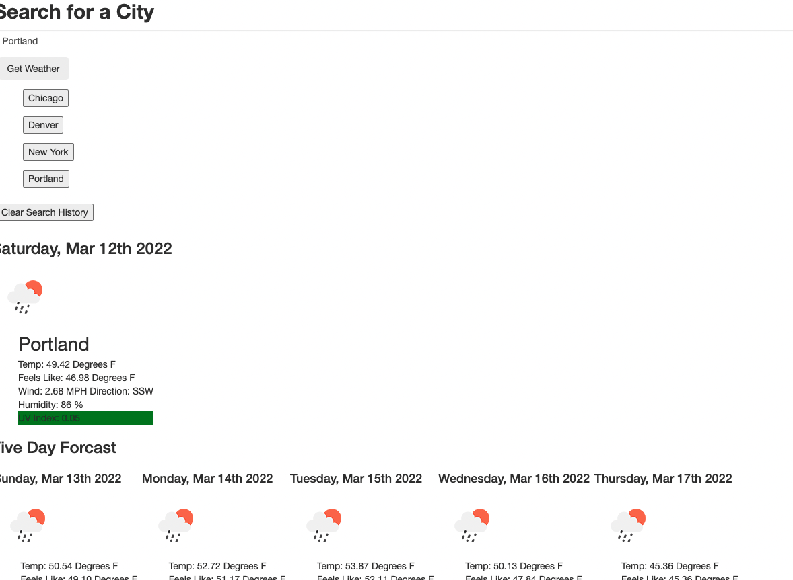

# Multi_City_Weather_Dashboard
A web app to display upcoming weather for cities input by the user.

## Description

The goal with this project was to create a dashboard that one could search for cities on to get the current weather as well as the 5 day forcast. The application runs natively in the browser and when a new city is searched for, a button is added to easily return to the information about that city. These buttons are saved locally and are available upon reload of the page. The weather information, and graphics are generated using the open weather api. The current weather is searched dirrectly from the city, while the forcast converts the search from the city into lattitude and longitude to use open weather's onecall api to retreive daily forcast information.

## Usage

See the deployed application [here](https://tward9.github.io/Multi_City_Weather_Dashboard/)

When opened, you should see the below image:
This image includes previous searches

